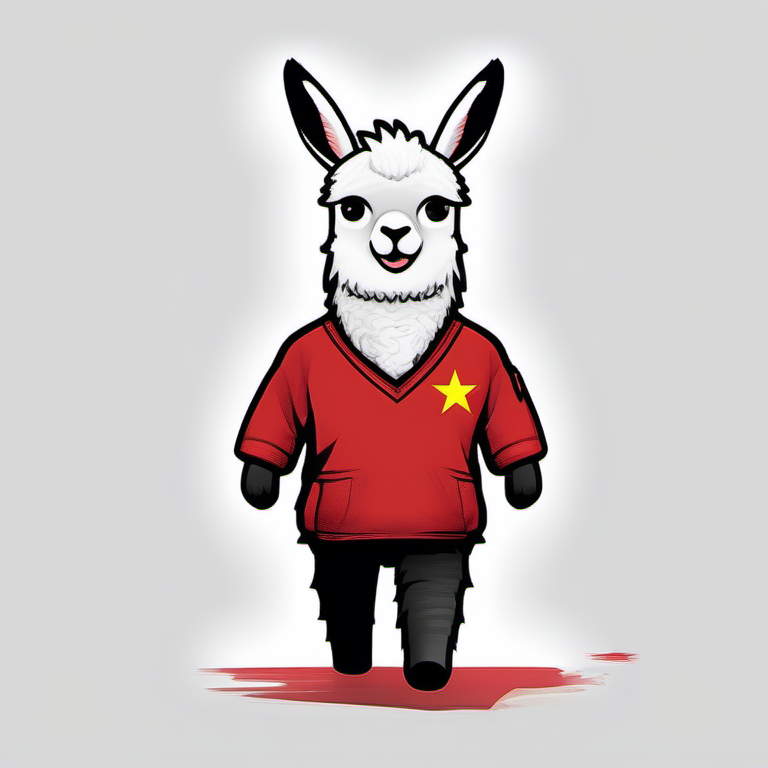
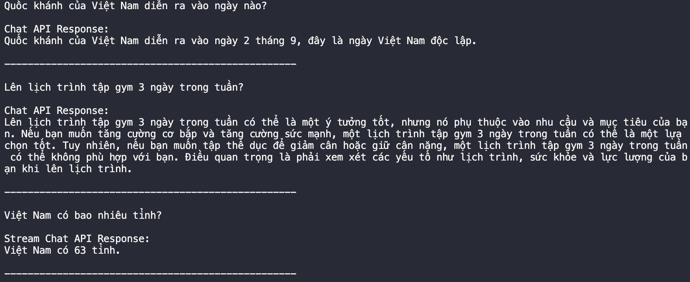

# Llama2 Vietnamese

<p align="center">
  
</p>

[Đọc bằng Tiếng Việt](README_vi.md)

A fine-tuned Large Language Model (LLM) for the Vietnamese language based on the Llama 2 model.

## Introduction

Language is the heart and soul of a culture. The Vietnamese language, filled with its nuances, idioms, and unique characteristics, has always been a beautiful puzzle waiting to be embraced by large language models. Taking baby steps, this project is an effort to bring the power of large language models to the Vietnamese language. 


## Current Status
### Aug 30th, 2023

We've just rolled out a experience version of a large language model for Vietnamese (finetuned on Llama2-7b (https://huggingface.co/meta-llama/Llama-2-7b-hf)). This model has been fine-tuned on a 20k instruction data sample. It's experimental and intended for lightweight tasks.

## Model Checkpoint

The model has been published on Huggingface and can be accessed [here](https://huggingface.co/ngoantech/Llama-2-7b-vietnamese-20k).

## Example Output
Here's a glance at what you can expect from the model:

  


## Getting Started

1. Clone the repository:
    ```bash
    git clone https://github.com/ngoanpv/llama2_vietnamese
    cd llama2_vietnamese
    ```

2. Install dependencies:
    ```bash
    pip install -r requirements.txt
    ```

3. Start the FastAPI server:
    ```bash
    python serving/fastapi/main.py
    ```

4. To test the server, use the provided script:
    ```bash
    python scripts/request_fastapi.py
    ```

## Limitations

1. Predominant Focus on English: The original version of Llama 2 was chiefly focused on English-language data. While we've fine-tuned this model specifically for Vietnamese, its underlying base is primarily trained on English.
2. Limited Fine-tuning: The current model has been fine-tuned on a small dataset. We are working on expanding the dataset and will release new versions as we make progress.
3. Usage Caution: Owing to these limitations, users are advised to exercise caution when deploying the model for critical tasks or where high linguistic accuracy is paramount.

## Vision


"Start small, stay small" guides our journey, but dreams are limitless. We envision a future where the nuances of the Vietnamese language are seamlessly captured by AI. 

Stay tuned for future releases as we are continuously working on improving the model, expanding the dataset, and adding new features. Your feedback and support will be instrumental in turning this dream into reality.